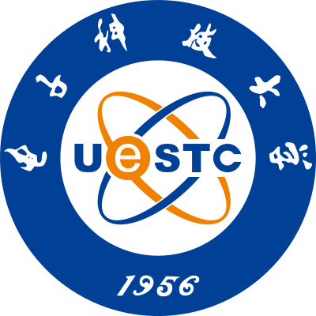

Hi! Thanks for visiting my homepage!  

I am Wang Yushen, a third-year undergraduate student majoring in communication engineering at [University of Electronic Science and Technology of China (UESTC)](https://www.uestc.edu.cn/) under the supervision of [Prof. Weidong Mei](https://faculty.uestc.edu.cn/meiweidong/zh_CN/index.htm) from [National Key Laboratory of Wireless Communications](https://www.ncl.uestc.edu.cn/), UESTC. Currently I am looking for graduate programs (Ph.D. > Master) of Fall 2026 in broad areas related to wireless communications and artificial intelligence.  

## 🔬 Research Interests
- 📡 Wireless Communications: e.g., Integrated Sensing and Communications (ISAC)  
- 🤖 Deep Learning: e.g., computer vision for image processing  
- 🧠 AI for X: e.g., AI-empowered wireless communications  

## 📚 Publications
**Antenna Position Optimization for Movable Antenna-Empowered Near-Field Sensing**  
**Y. Wang**, [W. Mei](https://faculty.uestc.edu.cn/meiweidong/zh_CN/index.htm), [X. Wei](https://scholar.google.com/citations?user=pkDJmeMAAAAJ&hl=zh-CN), [B. Ning](https://scholar.google.com/citations?user=ftQU5UcAAAAJ&hl=zh-CN), and [Z. Chen](https://faculty.uestc.edu.cn/chenzhi2/zh_CN/index.htm),  
accepted by *2025 International Conference on Communications (ICC) Workshop* and currently available on *arXiv*. [[PDF](https://arxiv.org/pdf/2502.03169)]  

## 🎉 Honors
- 2022-2023: Corporate Scholarship, Luzhou Laojiao
- 2023-2024: **National Scholarship**, Chinese Ministry of Education
- 2022-2023, 2023-2024: Outstanding Student Scholarship, UESTC  

## 🏆 Awards
- May 2024: National Third Prize, National English Competition for College Students
- Feb. 2024: Honorable Mention, Mathematical Contest in Modeling  

## 🎓 Education

    

        
    

    

        
University of Electronic Science and Technology of China

        <ul>
            <li>B.Eng. in Communication Engineering, Sept. 2022 - Jun. 2026 (expected)</li>
            <li>Supervisor: <a href="https://faculty.uestc.edu.cn/meiweidong/zh_CN/index.htm">Prof. Weidong Mei</a></li>
        </ul>
    

